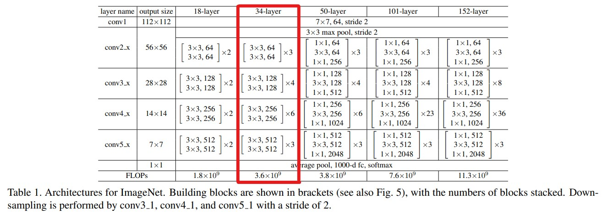

# ResNet
### 1. Resnet Paper [Directory]
Read a Resnet paper and explain it.
* 1512.03385 : resnet paper
* Resnet_Paper_Review.pdf : review

### 2. Resnet in Pytorch
Resnet implementation in **Pytorch**

I write the code according to the following table.

### 2-1. Test
'''c
Train Epoch: 56 | Batch Status: [0/50000] 	| Loss: 0.005 	| Acc: 100.000% (256/256)
Train Epoch: 56 | Batch Status: [2560/50000] 	| Loss: 0.006 	| Acc: 99.396% (2799/2816)
Train Epoch: 56 | Batch Status: [5120/50000] 	| Loss: 0.013 	| Acc: 99.182% (5332/5376)
Train Epoch: 56 | Batch Status: [7680/50000] 	| Loss: 0.022 	| Acc: 99.131% (7867/7936)
Train Epoch: 56 | Batch Status: [10240/50000] 	| Loss: 0.010 	| Acc: 99.123% (10404/10496)
Train Epoch: 56 | Batch Status: [12800/50000] 	| Loss: 0.009 	| Acc: 99.180% (12949/13056)
Train Epoch: 56 | Batch Status: [15360/50000] 	| Loss: 0.024 	| Acc: 99.225% (15495/15616)
Train Epoch: 56 | Batch Status: [17920/50000] 	| Loss: 0.012 	| Acc: 99.257% (18041/18176)
Train Epoch: 56 | Batch Status: [20480/50000] 	| Loss: 0.044 	| Acc: 99.267% (20584/20736)
Train Epoch: 56 | Batch Status: [23040/50000] 	| Loss: 0.029 	| Acc: 99.283% (23129/23296)
Train Epoch: 56 | Batch Status: [25600/50000] 	| Loss: 0.025 	| Acc: 99.265% (25666/25856)
Train Epoch: 56 | Batch Status: [28160/50000] 	| Loss: 0.024 	| Acc: 99.275% (28210/28416)
Train Epoch: 56 | Batch Status: [30720/50000] 	| Loss: 0.021 	| Acc: 99.283% (30754/30976)
Train Epoch: 56 | Batch Status: [33280/50000] 	| Loss: 0.013 	| Acc: 99.281% (33295/33536)
Train Epoch: 56 | Batch Status: [35840/50000] 	| Loss: 0.018 	| Acc: 99.274% (35834/36096)
Train Epoch: 56 | Batch Status: [38400/50000] 	| Loss: 0.014 	| Acc: 99.270% (38374/38656)
Train Epoch: 56 | Batch Status: [40960/50000] 	| Loss: 0.043 	| Acc: 99.279% (40919/41216)
Train Epoch: 56 | Batch Status: [43520/50000] 	| Loss: 0.011 	| Acc: 99.292% (43466/43776)
Train Epoch: 56 | Batch Status: [46080/50000] 	| Loss: 0.032 	| Acc: 99.307% (46015/46336)
Train Epoch: 56 | Batch Status: [48640/50000] 	| Loss: 0.003 	| Acc: 99.309% (48558/48896)
Training Time %d min %d sec 270 32
top-1 error : 26.930% (2693/10000)
top-5 error : 2.890% (289/10000)
'''

#### reference
* https://github.com/kuangliu/pytorch-cifar/blob/master/main.py
* https://gist.github.com/weiaicunzai/2a5ae6eac6712c70bde0630f3e76b77b
